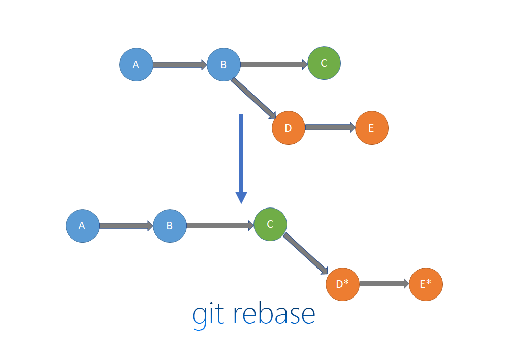

# Git branch

## Branch

> 분기라는 뜻. 분기점을 만드는 기능

- 현재 작업 중인 상태 (파일, 커밋 기록)은 그대로 별도로 관리되는 새로운 장소를 하나 더 형성
- 새로운 장소에서 관리되는 내용은 기존 작업하는 곳에 영향을 주지 않음
- 즉, 분기를 하면 그 순간부터 파일과 커밋 기록은 별도로 관리
- 사용자가 원할 때마다 브랜치(장소)를 옮겨가며 작업 가능
- 기존 브랜치가 있어야 특정 시점에서 새로운 브랜치 형성 가능

---

## Branch 관련 명령어

- `git branch -m (새 브랜치 명)` : 현재 브랜치 이름을 변경하는 명령어
- `git switch (브랜치 명)` : 브랜치 전환할 때 사용하는 명령어
- `git switch -c (새 브랜치 명)` : 새로운 브랜치를 형성하며 그 브랜치로 전환하는 명령어
- `git branch --list` : 모든 브랜치 리스트를 보여주고, 현재 어떤 브랜치를 이용중인지 표기해주는 명령어
- `git branch -D (브랜치 명)` : 특정 브랜치를 삭제해주는 명령어
    <aside>
    💡 2019년 이전엔 `git checkout`를 사용했으나, git 업데이트 이후 `git switch`를 사용하도록 권장
    
    </aside>

- `git merge` : 서로 다른 브랜치의 작업 내용을 하나의 브랜치로 통합하기 위한 명령어

---

## merge conflict

git이 하나의 commit 기록을 합치면서, 정확히 어떻게 합쳐야할지를 결정할 수 없을 때 발생

→ ex) 다른 장소에서 같은 파일의 같은 부분을 수정했을 때

<aside>
⚠️ 따라서 Git에서 협업을 할 때, 여러 사람이 동시에 한 파일의 같은 부분을 작업해서는 안됨!

</aside>

- `fast-forward` : 새로운 커밋을 남기지 않으면서 기록을 병합하는 방식
- `--no--ff` 를 이용하면 커밋 기록을 남길 수 있다.

---

## rebase

특정 브랜치를 기준으로 커밋 이력을 정렬하는 명령어

<aside>
⚠️ merge는 통합해주는 것이고 rebase는 정렬만 해준다!

</aside>



중복 로그를 남기지 않고, merge log를 줄여 히스토리를 깔끔하게 정리할 수 있어 Rebase는 주로 **히스토리를 깔끔하게 유지하기 위해** 사용

---

## Pull Request

- 바로 `merge`될 경우 발생할 수 있는 문제를 미리 방지하기 위해 사용
- 현재 코드에 대한 코드 리뷰를 진행하기 위해 사용
- 프로젝트에 대한 진행 상황을 관리하기 위해 사용

```bash
git fetch --prune
```

위 명령어를 통해 로컬과, 원격상에 브랜치 리스트를 동기화할 수 있다.

파일 내부 `.github` 폴더을 만들어 해당 폴더 내부에서 다양한 템플릿(issue, pull request 등)을 관리할 수 있다.
