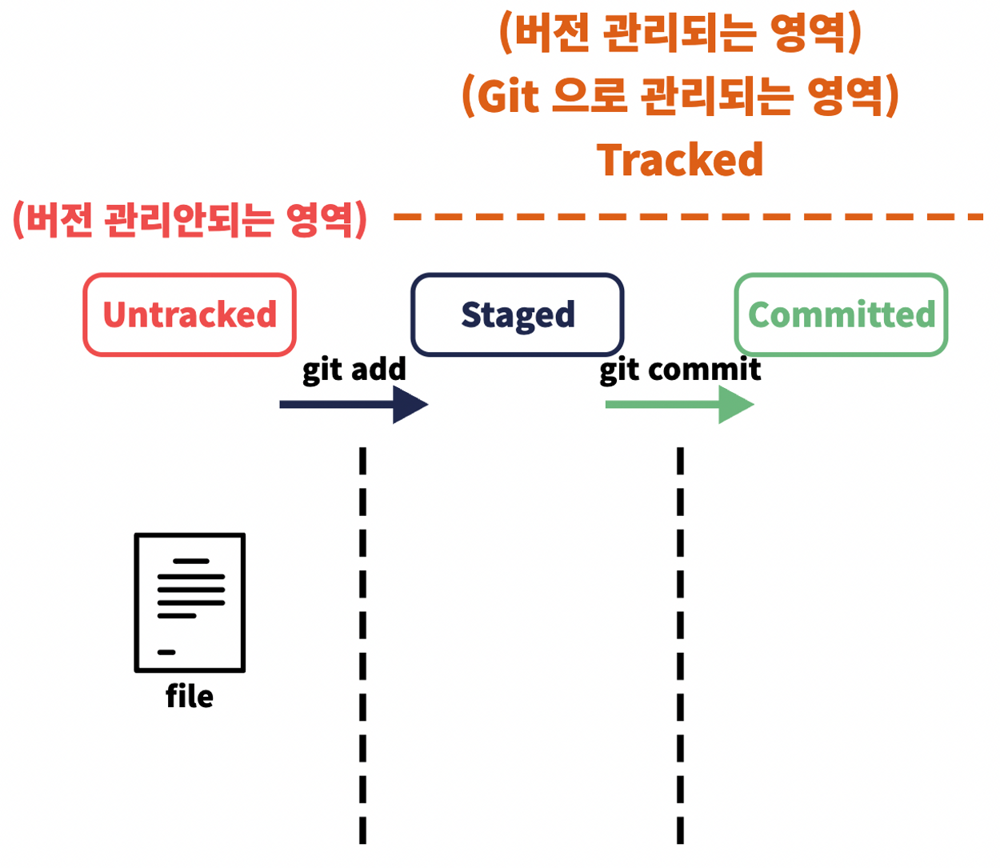

# Git & Github

## CLI vs GUI

- `command line interface` or `command user interface`
  - 사용자가 컴퓨터와 command(명령어) 기반으로 소통
  - 명령어 예시
    ```bash
    pwd # 현재 경로 출력
    ls # 현재 경로에 존재하는 파일/폴더들을 리스팅
    mkdir (폴더명) # 새로운 폴더명으로 폴더 형성
    cd (경로) # 경로 변경
    cd .. # 해당 경로의 상단 경로로 이동
    ```
- `graphic user interface`
  - 사용자가 알기쉽게 입출력 등의 기능을 아이콘따위의 그래픽으로 나타낸 것
  - 개발자들이 원하는 명령을 자유롭게 수행하기엔 한계가 존재

---

## 상대경로 vs 절대경로

> 경로란 파일, 폴더가 위치한 주소

- 상대경로
  - 현재 위치한 경로가 기준, 특정 파일/폴더의 경로
  - `.` : 현재 폴더
  - `..` : 상위 폴더
- 절대경로
  - 현재 위치와 상관없는 특정 파일/폴더의 경로
  - `/` : 루트 폴더

---

## Git이란?

**`git`**이란 특정 파일, 폴더의 버전관리를 위한 프로그램

<aside>
💡 버전관리란 프로젝트 등을 진행할 때, 진행 상황을 수시로 기록하면서, 필요할 때는 이전 상황으로 돌아갈 수 있게 해주는 등 종합적으로 폴더/파일의 수정 사항을 관리하는 것

</aside>

### `git` 시작하기!

- `git init` : git 저장소를 만드는 명령 `.git` 폴더를 생성
- `git add` : 어떤 파일들을 관리할지 지정하는 명령
- `git commit` : 현재 관리중인 파일을 하나의 버전으로 저장하는 명령
  - 이 때 저장된 버전 간에는 자유로운 이동이 가능
  - `git commit -m "(commit message)"` 를 통해 현재 버전의 설명 메세지 첨부 가능
  - `git commit --amend -m "(new commit message)"` 를 통해 가장 최근 커밋 메세지 수정 가능
- `git status` : 파일들의 상태를 보여주는 명령
  - `untracked` : `add` 이전 관리되기 전인 상태
  - `tracked` : `add` 이후 관리 중인 상태
  - `staged` : 관리 중이면서 `commit` 이전인 상태
    
- `git reset` : `staged` 된 파일을 다시 `unstaging` 하는 명령 (`add` 이전의 상태)
  - 특정 버전으로 돌아가 그 이후의 기록은 삭제
  - `git reset (커밋명)` 꼴로 **되돌아가고싶은** 버전을 명시!
  - `--soft` : 수정 사항 (이후의 커밋 내용) 에 대해서 그대로 두고, 기록만 삭제
  - `--hard` : 명시한 그 커밋 이후의 모든 수정사항들을 완전히 삭제
- `git log` : 지금까지 기록된 버전들을 출력하는 명령
- `git revert` : 현재까지의 버전 기록을 유지하면서 특정 버전 이전으로 되돌리는 명령
  - `git revert (커밋명)` 꼴로 **되돌리고싶은** 버전을 명시!
- `git clone` : 허브에 있는 repo 를 내 컴퓨터로 그대로 가져오고 싶을 때 쓰는 명령

---

## Github란?

`Git` 이 단순히 버전을 기록하고, 관리하는 도구라면, `Github` 는 이 기록들을 온라인 상에 업로드하고, 보관할 수 있게 해주는 서비스

```bash
git remote add origin (github repo 주소)
git push origin (branch이름)
```

### README.md

프로젝트에 대한 설명, 가이드라인 등을 담고 있는 문서

- 협업하는 개발자 및 내 코드를 살펴 볼 사람들을 위한 프로젝트 설명
- 내 프로젝트가 어떻게 사용될 수 있는지를 표현 (license 지정)
- 내가 지금 무엇을 만드는지, 만들었는지 정리 (→ 포트폴리오**)**

<aside>
💡 자신의 유저이름으로 github repo를 만들면 `readme.md`파일을 통해 github 프로필을 만들 수 있다!

</aside>

- github profile 꾸미기✨
  - Github Stats Card :
    https://github.com/anuraghazra/github-readme-stats/blob/master/docs/readme_kr.md
  - Tech Stack badge :
    https://github.com/alexandresanlim/Badges4-README.md-Profile
