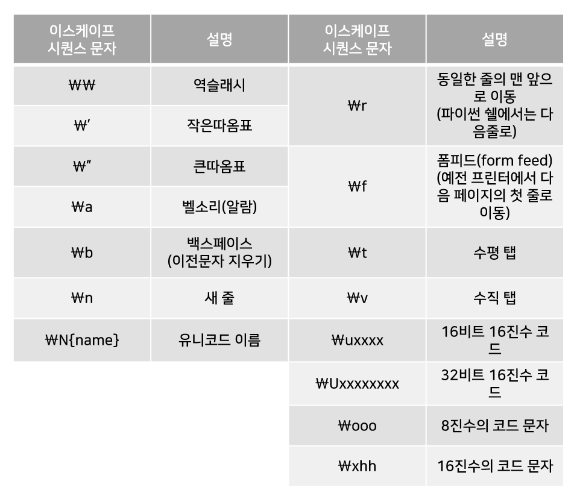
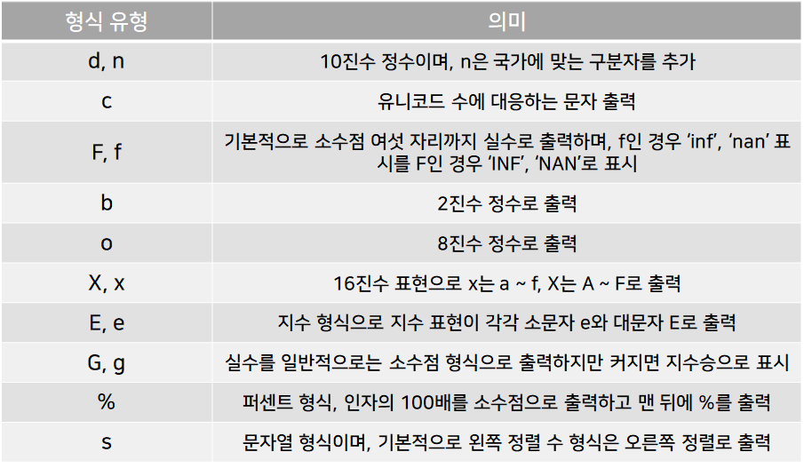

# 문자열

## 문자열 다루기

- 클래스와 객체

  > 클래스는 객체지향 프로그래밍 언어의 관점에서 객체를 정의하기 위한 틀 또는 모형인 템플릿(templet)이라고 한다. 객체는 클래스로부터 만들어진 하나의 구체적인 사례인 인스턴스(instance)다.

  > 클래스는 객체를 만들기 위한 정의, 객체는 해당 클래스의 구체적인 자료이다

- 문자열의 문자 참조

  함수 `len()`으로 문자열의 길이를 참조한다.

  ```python
  >>> sayHi = 'Hi there:)'
  >>> len(sayHi)
  10
  >>> len('Hello')
  5
  ```

  문자열을 구성하는 문자는 0부터 시작되는 첨자(index)를 대괄호 안에 기술해 참조(indexing)가 가능하다.

  ```python
  >>> 'Hello'[0]
  'H'
  >>> 'Hello'[3]
  'l'
  >>> 'Hello'[-1] # 역순으로도 참조 가능하다.
  'o'
  >>> 'Hello'[len('Hello')-1]
  'o'
  >>> 'Hello'[5] # 유효범위를 벗어나면 IndexError발생
  Traceback (most recent call last):
    File "<pyshell#9>", line 1, in <module>
      'Hello'[5]
  IndexError: string index out of range
  ```

- 문자열의 부분 문자열 참조 방식
  문자열 일부분을 참조하는 방법을 슬라이싱(slicing)이라고 한다.
  ```python
  >>> 'python'[1:5]
  'ytho'
  >>> 'python'[2:4]
  'th'
  >>> 'python'[0:6]
  'python'
  >>> 'python'[0:len('python')]
  'python'
  ```
  `[start:end]`로 부분 문자열을 반환하는데 `start` 첨자에서 `end-1` 첨자까지의 문자열을 반환한다.
  ```python
  >>> 'python'[-5:-1]
  'ytho'
  >>> 'python'[-3:-2]
  'h'
  >>> 'python'[-4:-2]
  'th'
  ```
  순반향의 `0`, `양수`, 역방향의 `음수`를 혼합해 슬라이싱에 사용할 수 있다.
  ```python
  >>> 'python'[1:-1]
  'ytho'
  >>> 'python'[0:2]
  'py'
  >>> 'python'[-5:5]
  'ytho'
  >>> 'python'[5:-1] # start와 end로 구성하는 문자열이 없다면 빈 문자열을 반환한다.
  ''
  ```
  슬라이싱에서 `start`와 `end`를 비우면 각각 '처음부터'와 '끝까지'를 의미한다.
  ```python
  >>> 'python'[:4]
  'pyth'
  >>> 'python'[2:]
  'thon'
  >>> 'python'[:]
  'python'
  ```
  `str[start:end:step]`으로 문자 사이의 간격을 step으로 조정 가능하다.
  ```python
  >>> 'python'[::1] # 기본 값
  'python'
  >>> 'python'[::2]
  'pto'
  >>> 'python'[::3]
  'ph'
  ```
  `step`은 음수도 가능하며, 이는 역순으로 구성된 문자열을 반환한다.
  ```python
  >>> 'python'[::-1]
  'nohtyp'
  >>> 'python'[::-2]
  'nhy'
  >>> 'python'[::-3]
  'nt'
  ```
- 문자 함수 `ord()`와 `chr()`
  - `ord()`
    문자의 유니코드 번호를 반환하는 내장 함수.
    ```python
    >>> ord('S')
    83
    >>> ord('P')
    80
    ```
  - `chr()`
    유니코드 번호로 문자를 반환하는 내장 함수.
    ```python
    >>> chr(83)
    'S'
    >>> chr(80)
    'P'
    ```
  - 이스케이프 시퀀스 문자
    하나의 문자를 역슬래시(`\`)로 시작하는 조합으로 표현하는 문자를 이스케이프 시퀀스 문자(escape sequence characters)라고 한다.
    
- 문자열의 최대와 최소
  내장 함수 `min()`은 최솟값을, 내장 함수 `max()`는 최댓값을 반환하는 함수이다.
  ```python
  >>> min('BirthDay')
  'B'
  >>> max('BirthDay')
  'y'
  >>> min('981130')
  '0'
  >>> max('981130')
  '9'
  ```
  인자가 문자열 1개이면 문자열을 구성하는 문자에서 코드 값으로 최대와 최소를 찾아 반환한다.
  ```python
  >>> min('happy', 'birth', 'day')
  'birth'
  >>> max('happy', 'birth', 'day')
  'happy'
  >>> min('98', '11', '30')
  '11'
  >>> max('98', '11', '30')
  '98'
  ```
  인자가 2개 이상이면 문자열 중 최대와 최소인 문자열을 반환한다.

---

## 문자열 관련 메소드

클래스에 소속된 함수를 메소드(method)라 한다. 메소드의 호출은 `문자열 객체명.함수 이름(인자)`와 같이 사용된다.

- 문자열을 대체하는 메소드 `replace()`

  ```python
  >>> str = 'Hi there, good morning:)'
  >>> str.replace('Hi', 'Hey')
  'Hey there, good morning:)' # 문자열 str을 수정하는 것이 아닌 대체된 문자열을 반환한다.
  >>> str.replace(' ', '') # 공백을 모두 없앤 문자열을 반환한다.
  'Hithere,goodmorning:)'
  ```

  `str.replace(a, b)`는 문자열 str에서 a가 나타나는 모든 부분을 b로 바꾼 문자열을 반환한다.
  `replace(old, new, count)`는 문자열 `old`를 `new`로 대체하는데, 옵션인 `count`는 대체 횟수를 지정한다.

  ```python
  >>> str = '파이썬 파이썬 파이썬'
  >>> str.replace('파이썬', 'Python!') # count가 없을 때 기본값은 모두 바꾸는 것이다.
  'Python! Python! Python!'
  >>> str.replace('파이썬', 'Python!', 1)
  'Python! 파이썬 파이썬'
  >>> str.replace('파이썬', 'Python!', 2)
  'Python! Python! 파이썬'
  ```

    <aside>
    💡 한 번 만들어진 문자열은 수정될 수 없다는(immutable) 특징이 있다.
    
    </aside>

- 부분 문자열 출현 횟수를 반환하는 메소드 `count()`

  ```python
  >>> str = '내가 그린 기린 그림은 목이 긴 기린 그림이고,'
  >>> str.count('기린')
  2
  >>> str.count('그린')
  1
  ```

  문자열 `str`에서 `str.count(부분 문자열)` 형태를 사용한다. 문자나 부분 문자열의 출현 횟수를 반환한다.

- 문자와 문자 사이에 문자열을 삽입하는 메소드 `join()`
  ```python
  >>> '->'.join('12345')
  '1->2->3->4->5'
  >>> num = '12345'
  >>> '->'.join(num)
  '1->2->3->4->5'
  ```
  문자열 중간중간에 원하는 문자 또는 문자열을 삽입하여 반환한다.
- 함수와 메소드

  > 함수(function)는 특정 작업을 수행하는 독립된 '코드 모임'이다. 반면 메소드(method)는 클래스에 포함되어 있는 함수를 말한다.

  > 함수는 독립적으로 직접 호출하지만 메소드는 객체를 통해 호출한다.

- 문자열을 찾는 메소드 ƒƒ`()`와 `index()`
  클래스 `str`에서 부분 문자열 `sub`가 맨 처음에 위치한 첨자를 반환받기위해 `str.find(sub)` 또는 `str.index(sub)`를 사용한다.
  ```python
  >>> str = 'Java C Python Go'
  >>> str.find('Java')
  0
  >>> str.index('Java')
  0
  >>> str.find('Py')
  7
  >>> str.index('Pyth')
  7
  >>> str.find('C#') # 찾는 문자열이 없다면 -1을 반환한다.
  -1
  >>> str.index('C#') # 찾는 문자열이 없다면 ValueError를 발생시킨다.
  Traceback (most recent call last):
    File "<pyshell#23>", line 1, in <module>
      str.index('C#')
  ValueError: substring not found
  ```
  메소드 `rfind()`와 `rindex()`는 역순으로 부분 문자열을 찾아 첨자를 반환한다.
  ```python
  >>> apple = 'iphon ipad ipod'
  >>> apple.rfind('i')
  11
  >>> apple.rindex('i')
  11
  ```
- 문자열을 여러 문자열로 나누는 메소드 `split()`
  문자열 메소드 `str.split()`는 문자열 `str`에서 공백(`Spacebar`, `Tab`, `Enter` 키 등을 말함)을 기준으로 문자열을 나눠 준다.
  ```python
  >>> fruit = '사과 배 딸기 오렌지 복숭아 레몬'
  >>> fruit.split()
  ['사과', '배', '딸기', '오렌지', '복숭아', '레몬'] # 리스트로 반환된다.
  >>> movie = 'disney marvel'
  >>> first, second = movie.split() # 변수에 할당할 수 있다.
  >>> first, second
  ('disney', 'marvel')
  ```
  문자열 구분자를 이용해 나눌 수도 있다.
  ```python
  >>> APPL = 'iphone, ipad, ipod, mac, macpro'
  >>> APPL.split(', ')
  ['iphone', 'ipad', 'ipod', 'mac', 'macpro']
  ```
- 문자열 변환 메소드

  - 영문자 알파벳 변환 메소드
    ```python
    >>> 'python'.upper() # 모두 대문자로 변환해 반환
    'PYTHON'
    >>> 'PYTHON'.lower() # 모두 소문자로 변환해 반환
    'python'
    >>> 'python lecture'.capitalize() # 첫 문자만 대문자로 변환해 반환
    'Python lecture'
    >>> 'python lecture'.title() # 단어마다 첫 문자를 대문자로 변환해 반환
    'Python Lecture'
    >>> 'PyTHoN'.swapcase() # 소문자와 대문자를 서로 변환해 반환
    'pYthOn'
    ```
  - 폭을 지정하고 중앙에 문자열을 배치하는 메소드
    ```python
    >>> ' Hi there '.center(30, '*') # center(전체 문자열 폭, 채울 문자)
    '********** Hi there **********'
    >>> ' Hi there '.center(30, '=')
    '========== Hi there =========='
    >>> ' Hi there '.center(30) # 옵션 생략 시 기본값 공백 문자
    '           Hi there           '
    ```
  - 폭을 지정하고 왼쪽 또는 오른쪽 정렬하는 메소드
    ```python
    >>> 'python'.ljust(10,'*') # ljust(전체 문자열 폭, 채울 문자)
    'python****'
    >>> 'python'.ljust(10) # 옵션 생략 시 기본값 공백 문자
    'python    '
    >>> 'python'.rjust(10,'*') # ljust(전체 문자열 폭, 채울 문자)
    '****python'
    >>> 'python'.rjust(10) # 옵션 생략 시 기본값 공백 문자
    '    python'
    ```
  - 문자열 앞뒤의 특정 문자들을 제거하는 메소드
    ```python
    >>> '    python    '.lstrip() # 왼쪽
    'python    '
    >>> '    python    '.rstrip()
    '    python'
    >>> '    python    '.strip()
    'python'
    >>> '----python===='.strip('= -')
    'python'
    ```
  - 제로 0을 채워 넣는 메소드
    ```python
    >>> '1234'.zfill(5) # zfill(전체 문자열 폭)
    '01234'
    >>> '1234'.zfill(8)
    '00001234'
    >>> '-1234'.zfill(8)
    '-0001234'
    >>> '+1234'.zfill(8)
    '+0001234'
    ```
  - True or False를 반환하는 메소드
    ```python
    >>> 'iphone'.startswith('i') # 문자열이 해당 부분 문자열로 시작하는지 검사
    True
    >>> 'iphone'.endswith('phone') # 문자열이 해당 부분 문자열로 끝나는지 검사
    True
    >>> 'iphone12'.isidentifier() # 문자열이 식별자로 사용 가능한지 검사
    True
    >>> '12promax'.isidentifier()
    False
    >>> 'iPhone'.islower() # 문자열이 소문자인지 검사
    False
    >>> 'AAPL'.isupper() # 문자열이 대문자인지 검사
    True
    >>> 'Macpro Macair'.istitle() # 문자열을 구성하는 단어 첫문자가 대문자인지 검사
    True
    >>> '\t'.isspace() # 문자열에 공백이 포함되어 있는지 검사
    True
    >>> 'apple'.isalpha() # 문자열이 알파벳인지 검사
    True
    >>> '12'.isdecimal() # 문자열이 숫자인지 검사
    True
    >>> 'iphon11'.isdigit() # 문자열이 숫자인지 검사
    False
    >>> 'iphon11'.isnumeric() # 문자열이 숫자인지 검사
    False
    >>> 'iphon11'.isalnum() # 문자열이 영어, 한글, 또는 숫자인지 검사
    True
    >>> '\f'.isprintable() # 문자열이 출력 가능한지 검사
    False
    ```

- 출력을 정형화하는 메소드 `format()`

  ```python
  >>> beverage = '{} + {} = {}'.format('orange', 'juice', 'orange' + 'juice')
  >>> print(beverage)
  orange + juice = orangejuice
  ```

  문자열에서 `{}`을 제외한 나머지 부분은 그대로 출력된다.

  ```python
  >>> fruit = 'orange'
  >>> beverage = 'juice'
  >>> menu = '{} + {} -> {}'.format(fruit, beverage, fruit + beverage)
  >>> print(menu)
  orange + juice -> orangejuice
  ```

  변수로도 사용 가능하다.
  중괄호 `{}`를 이용해 출력 폭과 출력 형식, 인자의 순서를 정할 수 있다.

  ```python
  >>> a, b = 100, 4

  >>> '{2} = {0} / {1}'.format(a, b, a / b) # 정수 0부터 삽입한다.
  '25.0 = 100 / 4'
  >>> '{2} = {} / {}'.format(a, b, a / b) # 인자는 모두 넣거나, 모두 빼거나 한다.
  Traceback (most recent call last):
    File "<pyshell#36>", line 1, in <module>
      '{2} = {} / {}'.format(a, b, a / b)
  ValueError: cannot switch from manual field specification to automatic field numbering

  >>> '{:d} / {:d} = {:f}'.format(a, b, a / b) # 출력의 형식을 지정한다.
  '100 / 4 = 25.000000'
  >>> '{:7d} / {:7d} = {:7.3f}'.format(a, b, a / b) # 출력의 폭을 지정한다.
  '    100 /       4 =  25.000'
  ```

  - 문자열 유형
    
